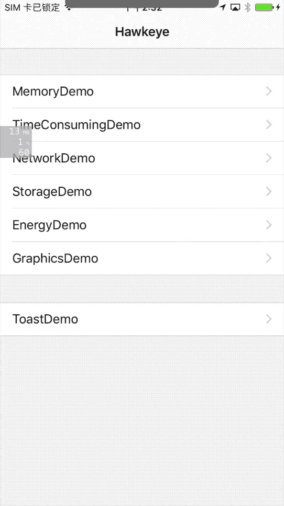
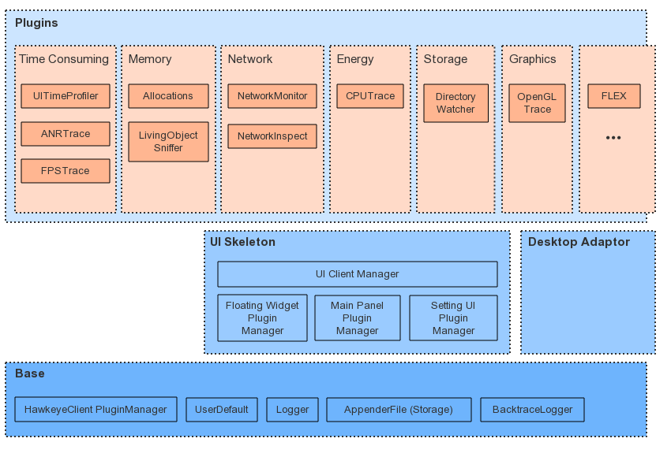

# MTHawkeye

[](http://cocoapods.org/pods/MTHawkeye) 
[](https://github.com/meitu/MTHawkeye/blob/master/LICENSE) 
[](https://github.com/meitu/MTHawkeye/pulls) 
[](http://cocoapods.org/pods/MTHawkeye)

MTHawkeye 是 iOS 下的调试优化辅助工具集，旨在帮助 iOS 开发者提升开发效率、辅助优化性能体验。

在产品开发周期内，我们引入 MTHawkeye 来帮助我们更快的发现、查找、分析、定位、解决问题：

- 开发阶段，侧重于开发调试辅助，及时侦测问题，并在必要时提示开发者及时处理
- 测试阶段，侧重于根据测试场景，收集尽可能多的数据，用于自动化测试分析报告
- 线上阶段，侧重补充传统 APM 组件缺失，但自身业务需要收集的一些性能数据

MTHawkeye 内置了一些常用的性能侦测相关插件，也引入并改进了 FLEX 作为调试辅助的一个插件，应用接入 MTHawkeye 时可自定义增改自己需要的插件。

以下为一些内置插件的 demo 演示图，分别用于`查看主线程耗时方法`，`查看 App 内存分配详情`，`查看网络请求详情记录`。更多插件及说明见后文。

  

## 0x00 功能简介

MTHawkeye 简单可分为上中下三层，除了最下面的`基础层`外，中间为`UI 基础层`，最上层的各个插件内部根据不同场景做了职责拆分，应用可根据自己的需要接入。整体结构如下：



### 基础功能

`基础层`主要提供了插件管理能力，[存储能力](./doc/hawkeye-storage-cn.md)和一些基础工具类。
`UI基础层` 则提供了开发、测试阶段使用的界面交互框架，包含了悬浮窗、主界面框架和设置面板，插件可以集成到其中。

### 内置的可选插件

内置的插件根据关注点分成了 `Memory`, `TimeConsuming`, `Energy`, `Network`, `Graphics`, `Storage`, `Utility` 几个类别。

#### Memory

##### # [LivingObjectSniffer](./doc/memory/unexpected-living-objects-sniffer-cn.md)

`LivingObjectSniffer` 主要用于跟踪观察 ViewController 直接或间接持有的对象，以及自定义 View 对象，侦测他们是否异常存活，比如内存泄露、未及时释放或者不必要的内存缓存。

在开发、测试阶段，侦测到的异常情况可以以浮窗警告、Toast 的形式提示开发、测试人员。自动化测试时也可以直接提取记录的存活对象做进一步的分析判断。

##### # [Allocations](./doc/memory/allocations-cn.md)
  
`Allocations` 类同于 Instrument 的 Allocations 功能，跟踪应用实际分配的内存详情，在应用内存使用异常（异常上升、OOM 退出）时可以通过记录的内存使用详情数据，来排查内存使用问题。

#### TimeConsuming

##### # [UITimeProfiler](./doc/time-consuming/ui-time-profiler-cn.md)

`UITimeProfiler` 用于辅助主线程耗时任务的优化。

数据采集部分主要包含 VC Life Trace 和 ObjC CallTrace 两个组件。VC Life Trace 用于跟踪 ViewController 打开各个阶段的具体时间点，ObjC CallTrace在开启后，则可跟踪耗时大于指定阈值的 Objective-C 方法。

界面层部分将两部分的数据合并展示，便于开发者更便捷的找出关注流程的耗时信息。示例图如前文的动图，更详细的说明见插件说明文档。

自动化测试、线上阶段接入后，无需埋点或插入其他代码，即可持续的跟踪启动耗时、页面打开耗时和其他关键流程耗时。

##### # [ANRTrace](./doc/time-consuming/anr-tracer-cn.md)

`ANRTrace` 用于捕获卡顿事件，同时采样卡顿发生时的主线程调用栈。

##### # [FPSTrace](./doc/time-consuming/fps-tracer.md)

`FPSTrace` 用于跟踪界面 FPS 以及 OpenGL 刷新绘制 FPS，并在浮窗上显示当前值。

#### Energy

##### # [CPUTrace](./doc/energy/cpu-trace-cn.md)

`CPUTrace` 用于跟踪 CPU 持续高使用率，同时记录高使用率期间主要调用了哪些方法。

#### Network

##### # [NetworkMonitor](./doc/network/network-monitor-cn.md)

`NetworkMonitor` 监听记录 App 内 HTTP(S) 网络请求的各个阶段耗时，并提供内置的记录查看界面，便于开发者排查优化网络问题。

1. 继承 FLEX 的网络请求记录，过滤搜索裸机价。同时优化了监听初始化逻辑，大幅减少对启动时间的影响
2. 针对 iOS 9 后的 NSURLSession 的请求，增加记录 URLSessionTaskMetrics 方便查看请求各个阶段的时间
3. 基于 URLSessionTaskMetrics 增加类似 Chrome 网络调试的 waterfall 视图，方便查看网络请求的队列和并发情况
4. 增加重复网络请求的侦测
5. 增强搜索栏，支持多条件搜索（域名筛选、重复请求、url 过滤、status 过滤）
6. 记录展示完整的网络请求记录（增加 request headers, request body, response body 记录）

##### # [NetworkInspect](./doc/network/network-inspect-cn.md)

`NetworkInspect` 插件基于 Network Monitor，根据记录的网络请求实际情况，侦测是否有可改进优化的项，上层可以自定义自己的规则。

#### Graphics

##### # [OpenGLTrace](./doc/graphics/opengl-trace-cn.md)

`OpengGLTrace` 用于跟踪 OpenGL 资源内存占用情况，辅助发现 OpenGL API 错误调用、异常参数传递。

#### Storage

##### # [DirectoryWatcher](./doc/storage/directory-watcher-cn.md)

`DirectoryWatcher` 主要用于沙盒文件夹的大小跟踪，便于开发测试过程中发现异常的文件管理问题。同时也集成了 FLEX 的沙盒文件查看。

#### Utility

##### # [FLEX](https://github.com/Flipboard/FLEX)

MTHawkeye 插件扩展支持了沙盒文件的 AirDrop 功能。

### 桌面扩展

如果需要将插件扩展到桌面端，如在桌面上查看处理插件收集到的信息，可基于各插件提供的接口获取数据，然后桥接到第三方桌面端提供的协议。如

- [Facebook Flipper](https://github.com/facebook/flipper)
- [Woodpecker](http://www.woodpeck.cn/)

## 0x01 接入

### 开发阶段接入

首先，以 pod 的形式，在项目 podfile 文件中加入 MTHawkeye 引用：

```ruby
  #< Only used during Debug
  #< Since the podfile dependency doesn't support environment configuration, 
  #< the dependent pods also need to be explicitly configured as Debug.
  
  def hawkeye
    pod 'MTHawkeye', :configurations => 'Debug'

    pod 'FLEX', :configurations => ['Debug']
    pod 'FBRetainCycleDetector', :configurations => ['Debug']
    pod 'fishhook', :configurations => ['Debug']
    pod 'CocoaLumberjack', :configurations => ['Debug'] # CocoaLumberjack is optional, change to `MTHawkeye/DefaultPluginsWithoutLog` if don't need.
    # pod 'MTGLDebug', :configurations => ['Debug'] # MTGLDebug is exclude by default, change `MTHawkeye` to `MTHawkeye/DefaultPlugins` to include.

    pod 'MTAppenderFile', :configurations => ['Debug']
  end

  target "YourProject" do
    hawkeye

    # ...
  end
```

然后，在应用启动时开启 MTHawkeye 服务。可以使用默认集成的所有插件，或者选择自己需要的插件启动。

A: 快速集成默认的所有插件:

```objc
#ifdef DEBUG
  #import <MTHawkeye/MTRunHawkeyeInOneLine.h>
#endif

- (BOOL)application:(UIApplication *)application didFinishLaunchingWithOptions:(NSDictionary *)launchOptions {
#ifdef DEBUG
  [MTRunHawkeyeInOneLine start];
#endif
  // ...
}
```

<details>
<summary> B: 选择需要的插件、插入外部新的插件: </summary>

```objc
- (BOOL)application:(UIApplication *)application didFinishLaunchingWithOptions:(NSDictionary *)launchOptions {
  [self startCustomHawkeye];
  // ...
}

- (void)startCustomHawkeye {
#ifdef DEBUG
  [[MTHawkeyeClient shared]
    setPluginsSetupHandler:^(NSMutableArray<id<MTHawkeyePlugin>> *_Nonnull plugins) {
      [MTHawkeyeDefaultPlugins addDefaultClientPluginsInto:plugins];

      // add your additional plugins here.
    }
    pluginsCleanHandler:^(NSMutableArray<id<MTHawkeyePlugin>> *_Nonnull plugins) {
      // if you don't want to free plugins memory, remove this line.
      [MTHawkeyeDefaultPlugins cleanDefaultClientPluginsFrom:plugins];

      // clean your additional plugins if need.
    }];

  [[MTHawkeyeClient shared] startServer];

  [[MTHawkeyeUIClient shared]
    setPluginsSetupHandler:^(NSMutableArray<id<MTHawkeyeMainPanelPlugin>> *_Nonnull mainPanelPlugins, NSMutableArray<id<MTHawkeyeFloatingWidgetPlugin>> *_Nonnull floatingWidgetPlugins, NSMutableArray<id<MTHawkeyeSettingUIPlugin>> *_Nonnull defaultSettingUIPluginsInto) {
      [MTHawkeyeDefaultPlugins addDefaultUIClientMainPanelPluginsInto:mainPanelPlugins
                                    defaultFloatingWidgetsPluginsInto:floatingWidgetPlugins
                                          defaultSettingUIPluginsInto:defaultSettingUIPluginsInto];


        // add your additional plugins here.
    }
    pluginsCleanHandler:^(NSMutableArray<id<MTHawkeyeMainPanelPlugin>> *_Nonnull mainPanelPlugins, NSMutableArray<id<MTHawkeyeFloatingWidgetPlugin>> *_Nonnull floatingWidgetPlugins,NSMutableArray<id<MTHawkeyeSettingUIPlugin>> *_Nonnull defaultSettingUIPluginsInto) {
      // if you don't want to free plugins memory, remove this line.
      [MTHawkeyeDefaultPlugins cleanDefaultUIClientMainPanelPluginsFrom:mainPanelPlugins
                                      defaultFloatingWidgetsPluginsFrom:floatingWidgetPlugins
                                            defaultSettingUIPluginsFrom:defaultSettingUIPluginsInto];

      // clean your additional plugins if need.
    }];

  dispatch_async(dispatch_get_main_queue(), ^(void) {
    [[MTHawkeyeUIClient shared] startServer];
  });
#endif
}
```

</details>

### 测试、线上阶段接入

测试阶段时可能有特殊的需求，而线上阶段可能不需要保留界面部分的代码。这个时候你可以根据工程的需要创建一个新的 `podspec`, 在 podspec 里引入在测试、线上阶段要引入的 MTHawkeye subspec, 然后在 podfile 内引入

```ruby
  pod 'YourOnlineHawkeye', :podspec => 'xxx/yourOwnHawkeyeOnline.podspec', :configurations => 'Release'
```

然后在初始化内根据自己的需要加载插件，配置插件是否启动（默认不启动），如

```objc
#ifdef Release
  [MTHawkeyeUserDefaults shared].allocationsTraceOn = YES; // 根据需要开启插件、配置插件

  [[MTHawkeyeClient shared]
    setPluginsSetupHandler:^(NSMutableArray<id<MTHawkeyePlugin>> *_Nonnull plugins) {
      [plugins addObject:[MTHAllocationsHawkeyeAdaptor new]];

      // add your additional plugins here.
    }
    pluginsCleanHandler:^(NSMutableArray<id<MTHawkeyePlugin>> *_Nonnull plugins) {

    }];

  [[MTHawkeyeClient shared] startServer];
#endif
```

## 0x02 交互说明

基础操作说明：

- 悬浮窗
  - 展示、隐藏悬浮窗：使用三指长按两秒手势或者三指左滑手势
  - 显示、隐藏悬浮窗插件：进入设置界面，进入 Floating Window，显隐插件  
- 进入主面板：点击浮窗直接查看最近一次查看的面板
- 设置界面：进入主面板，点击标题呼出模块切换界面，点击右上角 `Setting` 进入设置界面

各插件的界面交互文档：[详见上文链接](#内置的可选插件)

## 0x03 开发自己的插件

如果有一个模块在开发过程中需要避开很多坑，或者开发过程中调试/优化相关的日志代码很多，可以考虑编写一个调试辅助组件，然后基于 Hawkeye 基础框架 API，可将这个组件接入到 Hawkeye 框架中使用，以便统一交互和接口。

如果你关注的性能指标在自动化测试时无法持续跟踪，考虑编写一个性能分析插件用于抓取性能数据。

详见：[MTHawkeye 插件开发说明文档](./doc/hawkeye-plugin-dev-guide-cn.md)

## 0x04 Contribute to MTHawkeye

For more information about contributing issues or pull requests, see [MTHawkeye Contributing Guide](./Contributing.md)。

## 0x05 Thanks

- [FLEX](https://github.com/Flipboard/FLEX)
- [Tencent Mars](https://github.com/Tencent/mars)
- [PLeakSniffer](https://github.com/music4kid/PLeakSniffer)
- [FBRetainCycleDetector](https://github.com/facebook/FBRetainCycleDetector)
- [iOS 微信内存监控](https://wetest.qq.com/lab/view/367.html)
- [深入剖析 iOS 性能优化](http://www.jianshu.com/p/c58001ae3da5)
- [RSSwizzle](https://github.com/rabovik/RSSwizzle)
- [fishhook](https://github.com/facebook/fishhook)
- [CocoaLumberjack](https://github.com/CocoaLumberjack/CocoaLumberjack)

## 0x06 License

MTHawkeye 使用 MIT 协议，详情请参考 [LICENSE](./LICENSE)。
