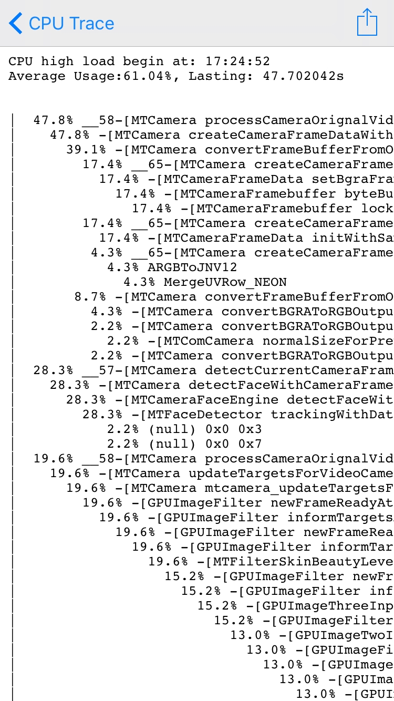
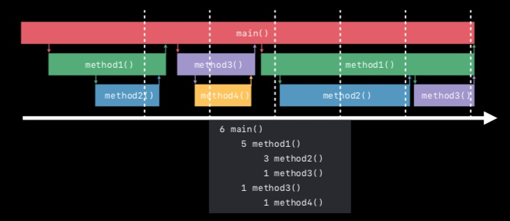

# Hawkeye - CPU Trace

`CPU Trace` 主要用于测试、线上阶段跟踪 CPU 持续高使用率，同时记录高使用率期间的的调用栈粗略占比。
有时候只有在一些特殊场景下出现手机发烫、耗电过快问题，但又刚好缺少 Instrument 的环境，这个时候可以通过 `CPU Trace` 来初步定位问题点。

## 0x00 使用

`CPU Trace` 模块在接入 Hawkeye 后默认开启，如果需要关闭或者调整阈值可以按以下步骤：

1. 启动App后，点击 Hawkeye 的浮窗进入主面板。
2. 点击导航栏 title，呼出 Hawkeye 面板切换界面。
3. 点击切换界面右上角的 `Setting`，进入 Hawkeye 设置主界面。
4. 找到 `Energy`, 进入`CPU Trace` 调整设置项

`CPU Trace` 记录的数据包含几个部分：

- 高负载的开始时间
- 高负载的持续时间
- 高负载期间的平均 CPU 使用率
- 高负载期间取样的调用堆栈方法占比树



## 0x01 实现说明

### 监测策略

```md
 d0 = 1s        Trigger Interval (Low Load)
 d1 = 0.3s      Trigger Interval (High Load)
 l1 = 60s       High load lasting limit
 th1 = 80%      High load threshold
 th2 = 15%      StackFrame dump threshold

 1. 启动后，每隔 d0 获取一次整体 cpu 使用率
    1.1 如果使用率大于 th1，切换为每隔 d1 获取一次整体 cpu
        1.1.1 如果使用率仍大于 th1，获取所有线程的 cpu 占用，且对站整体 th2 以上的线程做记录 stackframes 的操作
        1.1.1 如果持续 l1 时间，一直大于 th1，则触发耗能记录事件
            1.1.1.1 计算整体 cpu 占用平均值值
            1.1.1.2 合并这期间记录的 backtrace，按 frame 出现的次数生成一个占比数（参考 Xcode Energy Log）

    1.2 否则重头开始监测
```

### Stack Frames 取样及合并

每次 CPU 占用率超过阈值（默认 80%）时，会触发一次调用栈取样，只有 CPU 占比超过设定比例（默认 15%）的的线程才会记录 stackframes。

连续一段期间高负载对应的记录，会把这段期间内的 stackframes 样本做合并，目前已方法调用原始地址做比较值聚合。合并策略如图示：


## 0x02 存储数据说明

CPU 持续高耗记录生成后，会存储到 hawkeye 存储目录下的 Records 文件，[目录及读取参见]((./../hawkeye-storage-cn.md#0x02-内置插件存储数据说明)。 Records 每一行为一条记录，格式为

```md
collection,key,value
```

每一条 CPU 高耗记录拆分为两行，一行为基础数据，collection 名为 `cpu-highload`

```md
cpu-highload,575204521.78,{{basic-cpu-highload record}}
```

其中 key 为 CPU 高耗记录的开始时间，{{basic-cpu-highload record}} 为 json 字典字符串，包含三个字段，示例说明如下：

```json
{
    "start": "575204521.78", // CPU高负载开始时间
    "lasting": "132.60",     // CPU高负载的持续时间，单位秒
    "average": "106"         // CPU高负载期间整体的CPU占用率平均值, 106%
}
```

另一行为调用栈取样记录，collection 名为 `cpu-highload-stackframe`

```md
cpu-highload-stackframe,575204521.78,{{cpu-highload stackframes samples}}
```

其中 key 为 CPU 高耗记录的开始时间，{{cpu-highload stackframes samples}} 为 json 字典字符串，字段说明如下

- `frame`: stack frame，未符号化
- `proportion`: 这个样本占总体样本的比例
- `count`: 样本被采集次数
- `children`: 子调用采样记录

示例如下：

```json
[
    {
        "frame": "0x10234235",
        "proportion": 0.6,
        "count": 60,
        "children": [
            {
                "frame": "0x10234444",
                "proportion": 0.4,
                "count": 40
            },
            {
                "frame": "0x10235555",
                "proportion": 0.2,
                "count": 20
            }
        ]
    },
    {
        "frame": "0x10234111",
        "proportion": 0.3,
        "count": 30,
        "children": [
            {
                "frame": "0x10234112",
                "proportion": 0.3,
                "count": 30
            }
        ]
    },
    {
        "frame": "0x10234000",
        "proportion": 0.1,
        "count": 10
    }
]
```

外部读取时，需要同时把所有 collection 为 `cpu-highload` 和 `cpu-highload-stackframe` 的记录读取出来，根据上面的格式解析后，将 key 相同（start time）相同的记录合并到一起，即为所有的 CPU 高耗记录，外部展示的方式可参考上面的截图

## 0x03 符号化说明

`CPU Trace` 在运行过程中记录的 stack frames 为原始内存地址，需要进行符号化以便阅读。

如果是 debug 阶段或者程序包未去除符号表，则可直接使用 `CPU Trace` 主面板进入记录详情页查看符号化后的结果。

其他情况下，如果已经[自己实现了符号化服务](./../hawkeye-remote-symbolics.md)，并做了设置，可打开 `Remote Symbolics`，再查看详情记录时会切换调用远程符号化服务。

若想在程序退出运行后，从沙盒里拿到记录的数据，则需要自己进行符号化。手动操作可按以下步骤：

1. 拿到 hawkeye 存储目录下的 `dyld-images` 文件
2. 拿到待符号化的 stack-frames 数据
3. 拿到运行包对应的符号表文件
4. 针对每一个 stack-frame，找到所在 dyld-image, 使用 atos 命令进行符号化

## 0x04 性能影响

`CPU Trace` 运行时的主要耗时点在获取所有线程的 CPU 使用率和对高耗线程做堆栈取样操作上。

在 iPhone6s iOS 10.3.2 环境下，在跑的线程大概 30 个，原始整体 CPU 占用 90-100%，需要做堆栈取样的线程在 5 个以内。

- Release 下，每次获取所有线程的 CPU 使用率详情，平均耗时在 350 us 左右。Debug 下差异不大
- Release 下，每次对线程堆栈采样，平均耗时在 160us 左右。Debug 下大约在 290us

综上每次操作额外耗时在 1ms 内。而平时的 CPU 获取频率默认为 1s 每次，在 CPU 高耗时则是 0.3s 每次。