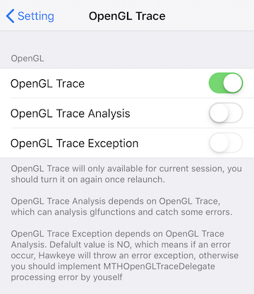
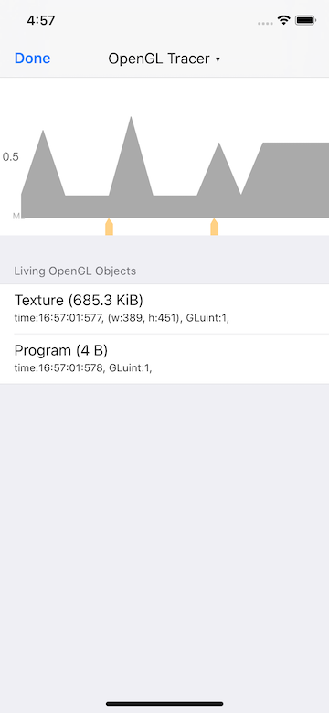
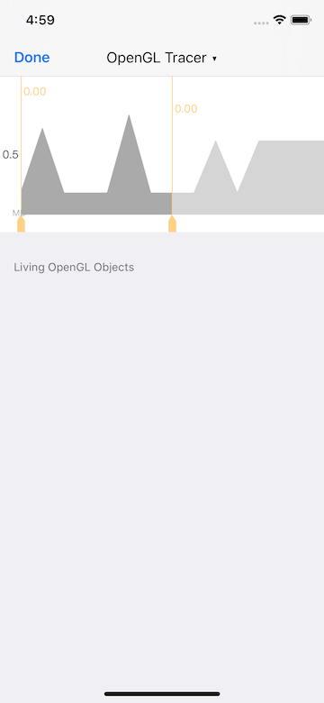
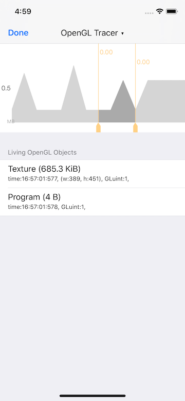

# Hawkeye - OpenGL Trace

`OpengGLTrace` is used to track the memory usage of OpenGL resources, and to help find OpenGL API error calls and exception parameter passing.

`OpenGL Trace` is base on [MTGLDebug](https://github.com/meitu/MTGLDebug), which inject tracking logic into the OpenGL API through [fishhook](https://github.com/facebook/fishhook).

## Usage

`OpenGL Trace` is closed after add to `MTHawkeyeClient`, you need to enable it manually:

1. Tap MTHawkeye floating window, enter the main panel.
2. Tap navigation title view, show the MTHawkeye panel switching view.
3. Tap `Setting` in the upper right corner of the switching view, enter the Setting view home.
4. Find `Graphic` and go to `OpenGL Trace`
    * Enable `OpenGL Trace`, trace the resource usage by OpenGL
    * Enable `Analysis` (Base on `OpenGL Trace`), help to find out API error calls and exception parameter passing.
    * Enable `Raise Exception Enabled` (Base on `Analysis`), throw exception when `Analysis` find the errors.

### OpenGL Resource Usage Trace

After `OpenGL Trace` is on, you can see the tacked OpenGL resource object on the main panel. Currently include:

* Texture
* Program
* FrameBuffer
* RenderBuffer

By default the panel shows all the resource objects that are still alive.

You can select a time range, view resources created during that time and still not released yet.

 

### Trace OpenGL common error calls and parameter exception

When the `OpenGL Trace` and `Analysis` are both on, it'll trace the common OpenGL call logic and parameters usage. Include following strategies:

* Access a resource handle that has never been created in any context.
* Access a resource whose context has been deleted.
* The resource handle of another context is logically deleted, and the texture handle may be the same when the two contexts are not shared.
* Access resource handles across contexts.
* OpenGL function is not called under a valid OpenGL context.
* Texture object size is 0.

The detecting result will be throw from `MTGLDebug` though delegate method `glDebugErrorMessageHandler:errorType:`, while `Raise Exception Enabled` is enabled, the message will be convert to exception and throw.

You can add your own logic to handle the result by implement the `glTracer:didReceivedErrorMsg:` under `MTHOpenGLTraceDelegate` protocol.

## Storage

While the `OpenGLTrace` is on, the OpenGL resource usage value will store under [Records file](./../hawkeye-storage.md#0x02-built-in-plugin-data-storage-instructions). Use a `collection` name `gl-mem`, `key` as the time store happens, `value` is the resource usage value, in MB.