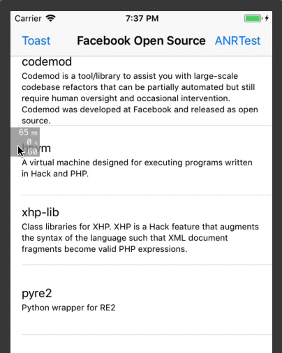
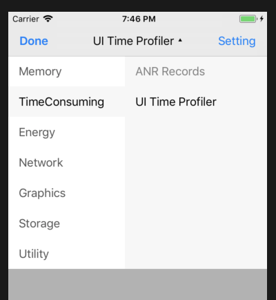
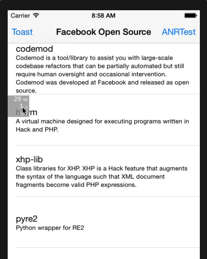
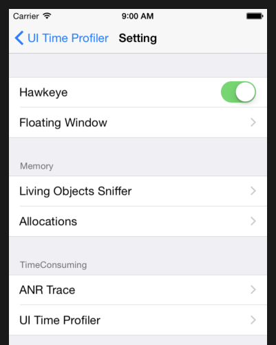

# 开发插件

什么情况下需要一个插件？如果有一个模块在开发过程中需要避开很多坑，或者开发过程中调试/优化相关的日志代码很多，可以考虑编写一个调试辅助组件，然后基于 MTHawkeye 基础框架 API，可将这个组件接入到 MTHawkeye 框架中使用，以便统一交互和接口。

## 0x00 插件组成

一个调试辅助组件接入到 MTHawkeye 时，除了主体，可以分为两部分。基础部分负责基础调度，并可使用 `MTHawkeye/Core` 提供的能力：

- 统一的插件生命周期管理
- 存储层
- 调用堆栈获取和堆栈符号化

另一部分则负责界面交互，使用 `MTHawkeye/UISkeleton` 提供的界面骨架

- 在 MTHawkeye Floating Window 显示实时的摘要信息（如 MEM, CPU, FPS）
- 快速搭建统一的设置界面
- 快速搭建统一管理的插件主界面
- Floating Widget 可实现警告样式，点击时可以关联跳到对应的 Main Pane
- MTToast 可用于开发阶段将发现的问题及时告知开发者

要使用 MTHawkeye 的基础调度和 `Hawkeye/Core` 能力，需要实现下文的 `MTHawkeyePlugin`。

要使用 MTHawkeye 的界面交互框架，则需要选择实现下文的 `MTHawkeyeMainPanelPlugin`, `MTHawkeyeFloatingWidgetPlugin`, `MTHawkeyeSettingUIPlugin`。

例如，内置用于跟踪 ANR 事件的 `ANRTrace` 插件

- 基层 `ANRTrace/Core` 只负责 ANR 事件的捕获
- 之上的 `ANRTrace/HawkeyeCore` 是适配层，将捕获到的事件存储到统一的存储层内
- 再之上的 `ANRTrace/HawkeyeUI` 则实现了界面层，用于在应用内查看记录的数据，在 ANR 触发时在 MTHawkeye 的浮窗上闪烁警告，并基于 MTHawkeye/UISkeleton 实现了插件设置界面，

```ruby
    tc.subspec 'ANRTrace' do |anr|
      anr.subspec 'Core' do |core|  # ANR 主体逻辑
        core.public_header_files = 'MTHawkeye/TimeConsumingPlugins/ANRTrace/Core/*.{h}'
        core.source_files = 'MTHawkeye/TimeConsumingPlugins/ANRTrace/Core/*.{h,m}'
        core.dependency 'MTHawkeye/Utils'
        core.dependency 'MTHawkeye/StackBacktrace'
      end

      anr.subspec 'HawkeyeCore' do |hc|  #
        hc.public_header_files = 'MTHawkeye/TimeConsumingPlugins/ANRTrace/HawkeyeCore/*.{h}'
        hc.source_files = 'MTHawkeye/TimeConsumingPlugins/ANRTrace/HawkeyeCore/*.{h,m}'
        hc.dependency 'MTHawkeye/Core'
        hc.dependency 'MTHawkeye/TimeConsumingPlugins/ANRTrace/Core'
      end

      anr.subspec 'HawkeyeUI' do |ui|
        ui.public_header_files = 'MTHawkeye/TimeConsumingPlugins/ANRTrace/HawkeyeUI/*.{h}'
        ui.source_files = 'MTHawkeye/TimeConsumingPlugins/ANRTrace/HawkeyeUI/*.{h,m,mm}'
        ui.dependency 'MTHawkeye/Core'
        ui.dependency 'MTHawkeye/UISkeleton'
        ui.dependency 'MTHawkeye/TimeConsumingPlugins/ANRTrace/HawkeyeCore'
      end
    end
```

## 0x01 插件协议

### 01. 实现 `MTHawkeyePlugin` 协议，以接入 MTHawkeyeClient 调度

```objc
@protocol MTHawkeyePlugin <NSObject>

@required
+ (NSString *)pluginID;
- (void)hawkeyeClientDidStart;
- (void)hawkeyeClientDidStop;

@optional
- (void)receivedFlushStatusCommand;

@end
```

1. 根据 `MTHawkeyePlugin` 协议内容
  a. 实现 `+ (NSString *)pluginID` 方法，可在使用 `[MTHawkeyeClient pluginFromID]` 时匹配已加入的插件
  b. 实现 `- (void)hawkeyeClientDidStart` 和 `- (void)hawkeyeClientDidStop`，处理插件自身的开关逻辑

    hawkeyeClientDidStart/Stop 仅表示 Hawkeye 主体开启和关闭，插件的具体开启关闭是否要与 MTHawkeyeClient 同步由具体插件的功能决定，如有些插件可能需要提前启动。

  c. 如果需要持续跟进记录应用、系统状态，可考虑实现 `- (void)receivedFlushStatusCommand` 方法，减少自己多实现一个定时器
2. 在调用 `-[MTHawkeyeClient setupPluginsSetup:pluginsCleaner:]` 初始化 MTHawkeyeClient 时，可通过 pluginsSetupHandler 将创建好的插件对象添加到 MTHawkeyeClient 中。示例代码在文末。

> 插件 API 详情可参考 `MTHawkeye/Core/MTHawkeyePlugin.h` 文件。

### 02. 为插件实现界面并接入到 MTHawkeyeUIClient 中

`MTHawkeyeUIClient` 包含了三个可被外部以插件形式插入的界面模块，桥接的协议分别是

- `MTHawkeyeFloatingWidgetPlugin` 桥接协议，用于在 MTHawkeye 悬浮窗下展示摘要信息。
- `MTHawkeyeMainPanelPlugin` 桥接协议，用于将你的插件主界面桥接到 MTHawkeye 下。
- `MTHawkeyeSettingUIPlugin` 桥接协议，用于在 MTHawkeye 下添加你的插件的设置界面。

以上协议可根据插件的实际需要实现，最终创建出的对象添加到 MTHawkeyeUIClient 中即完成了界面层的桥接。

#### A. 在 MTHawkeye 悬浮窗下展示你的插件要展示的摘要信息

`MTHawkeyeUIClient` 在启动后，默认会在 App 内显示一个悬浮窗口。外部可实现 `MTHawkeyeFloatingWidgetPlugin` 协议，然后创建浮窗插件添加到这个悬浮窗口上，用以实时显示一些状态信息（如内存、CPU、FPS、关键日志等）

```objc
@protocol MTHawkeyeFloatingWidgetDisplaySwitcherPlugin <NSObject>
@optional
- (MTHawkeyeSettingSwitcherCellEntity *)floatingWidgetSwitcher;
@end

@protocol MTHawkeyeFloatingWidgetPlugin <MTHawkeyeFloatingWidgetDisplaySwitcherPlugin>

@required
@property (nonatomic, weak) id<MTHawkeyeFloatingWidgetDelegate> delegate;

@required
- (NSString *)widgetIdentity;
- (MTHMonitorViewCell *)widget;
- (BOOL)widgetHidden;

@optional
- (void)receivedFlushStatusCommand;
- (void)receivedRaiseWarningCommand:(NSDictionary *)params;

@end
```

1. 实现 `- (NSString *)widgetIdentity` 以区别于其他指示器
2. 实现 `- (MTHMonitorViewCell *)widget`，返回一个 `MTHMonitorViewCell`，用于绘制指示器
3. 如果需要定时更新状态显示，建议实现 `- (void)receivedFlushStatusCommand`，更新 `MTHMonitorViewCell` 内容
4. 如果要在 `MTHMonitorViewCell` 上做警告提示，可实现 `- (void)receivedRaiseWarningCommand:(NSDictionary *)params`，并实现自己的警告样式 (示例见 FPS, MEM)
5. 如果需要在运行过程中动态显隐你的 floatingWidget，只需要调用 id<MTHawkeyeFloatingWidgetPlugin>.delegate 的 `floatingWidgetWantHidden:` 和 `floatingWidgetWantShow:` 方法。

实现示例可参考内置插件 `MTFPSHawkeyeUI`。

#### B. 将你的插件主界面桥接到 MTHawkeyeUIClient 下

MTHawkeyeUIClient 的悬浮窗口点击后，会跳到主面板，默认展示最后一次查看过的插件，点击标题可在不同插件视图间切换（如动图所示）。

, 

这些插件都是通过实现 `MTHawkeyeMainPanelPlugin` 协议，以把插件的界面加入到 MTHawkeyeUIClient 主面板下。

```objc
@protocol MTHawkeyeMainPanelPlugin <NSObject>

@required

- (NSString *)switchingOptionTitle;
- (NSString *)groupNameSwitchingOptionUnder;

@optional

- (NSString *)mainPanelTitle;

- (UIViewController *)mainPanelViewController;
- (NSString *)mainPanelIdentity;

- (BOOL)switchingOptionTriggerCustomAction;
- (void)switchingOptionDidTapped;

@end
```

1. 实现 `- (NSString *)switchingOptionTitle`, 即上图右侧入口的标题 ANR Records 和 UI Time Profiler
2. 实现 `- (NSString *)groupNameSwitchingOptionUnder`，即插件归属于哪个分组下，除图中内置的几个分组名外，也可使用自己的分组名
3. 根据入口点击行为的不同，分为以下两种情况
    - 如果在点击后，要在 MTHawkeyeUIClient 主面板下显示插件的主视图，则需要实现以下方法
        - `- (UIViewController *)mainPanelViewController`，插件展示的主面板
        - `- (NSString *)mainPanelIdentity`，主面板的唯一 id
        - `- (NSString *)mainPanelTitle`，可选，若未实现，则使用 `switchingOptionTitle` 返回的标题

    - 如果在点击后，不在 MTHawkeyeUIClient 主面板下显示一个视图（如 FLEX 插件点击后显示 FLEX 浮层），则实现以下方法
        - `- (BOOL)switchingOptionTriggerCustomAction` 返回 `YES`
        - 实现 `- (void)switchingOptionDidTapped`，内部实现自定义的点击触发逻辑

#### C. 在 MTHawkeyeUIClient 下添加你的插件的设置界面

为便于接入插件后，组内不同开发人员开关配置插件，建议增加必要的设置界面。设置界面的入口：进入 MTHawkeyeUIClient 主面板后，点击标题，弹出模块切换面板的右上角即为设置入口。

 

截图中的设置界面除了第一个 section，其他 section 均是通过实现 `MTHawkeyeSettingUIPlugin` 协议添加。添加后的设置项以 section name 聚合，Memory section 下的两个设置项分别来自 `LivingObjectSniffer` 和 `Allocations` 插件。

```objc
@protocol MTHawkeyeSettingUIPlugin <NSObject>

@required

+ (NSString *)sectionNameSettingsUnder;
+ (MTHawkeyeSettingCellEntity *)settings;
@end
```

- `+ (NSString *)sectionNameSettingsUnder` 用于控制归属的主界面 setting section
- 实现 `+ (MTHawkeyeSettingCellEntity *)settings` 返回的根设置实体项，有以下几种类型
  - `MTHawkeyeSettingFoldedCellEntity`, 可嵌套 setting entity 型的 cell，大多数插件使用这个类型作为根设置项。
  - `MTHawkeyeSettingEditorCellEntity`, 可编辑的值类型 cell
  - `MTHawkeyeSettingSwitcherCellEntity`, 开关型 cell
  - `MTHawkeyeSettingActionCellEntity`, 自定义点击行为 cell

一般实现 `+ (MTHawkeyeSettingCellEntity *)settings` 时返回一个 `MTHawkeyeSettingFoldedCellEntity` 类型的 cell，然后在 cell 内部放置实际的设置项实体（内置的插件均以这种形式实现）。

## 0x02 启用插件

切换使用自定义的方式启动 MTHawkeye，在 MTHawkeye 启动代码中插入编写的插件：

```objc
  [[MTHawkeyeClient shared]
    setPluginsSetupHandler:^(NSMutableArray<id<MTHawkeyePlugin>> *_Nonnull plugins) {
      [MTHawkeyeDefaultPlugins addDefaultClientPluginsInto:plugins];

      // add your additional plugins here.
    }
    pluginsCleanHandler:^(NSMutableArray<id<MTHawkeyePlugin>> *_Nonnull plugins) {
      // if you don't want to free plugins memory, remove this line.
      [MTHawkeyeDefaultPlugins cleanDefaultClientPluginsFrom:plugins];

      // clean your additional plugins if need.
    }];

  [[MTHawkeyeClient shared] startServer];

  [[MTHawkeyeUIClient shared]
    setPluginsSetupHandler:^(NSMutableArray<id<MTHawkeyeMainPanelPlugin>> *_Nonnull mainPanelPlugins, NSMutableArray<id<MTHawkeyeFloatingWidgetPlugin>> *_Nonnull floatingWidgetPlugins, NSMutableArray<id<MTHawkeyeSettingUIPlugin>> *_Nonnull defaultSettingUIPluginsInto) {
      [MTHawkeyeDefaultPlugins addDefaultUIClientMainPanelPluginsInto:mainPanelPlugins
                                    defaultFloatingWidgetsPluginsInto:floatingWidgetPlugins
                                          defaultSettingUIPluginsInto:defaultSettingUIPluginsInto];


        // add your additional plugins here.
    }
    pluginsCleanHandler:^(NSMutableArray<id<MTHawkeyeMainPanelPlugin>> *_Nonnull mainPanelPlugins, NSMutableArray<id<MTHawkeyeFloatingWidgetPlugin>> *_Nonnull floatingWidgetPlugins,NSMutableArray<id<MTHawkeyeSettingUIPlugin>> *_Nonnull defaultSettingUIPluginsInto) {
      // if you don't want to free plugins memory, remove this line.
      [MTHawkeyeDefaultPlugins cleanDefaultUIClientMainPanelPluginsFrom:mainPanelPlugins
                                      defaultFloatingWidgetsPluginsFrom:floatingWidgetPlugins
                                            defaultSettingUIPluginsFrom:defaultSettingUIPluginsInto];

      // clean your additional plugins if need.
    }];

  dispatch_async(dispatch_get_main_queue(), ^(void) {
    [[MTHawkeyeUIClient shared] startServer];
  });
```

其中 `setupHandler` block 会在 Client **启动** 时调用，会将这些插件添加到 Client 中，并调用这些插件的 `hawkeyeClientDidStart` 方法。

而 `cleanHandler` block 会在 Client **关闭** 时调用，可在此处做插件的内存回收操作，参考 MTHawkeyeDefaultPlugins 的做法。
