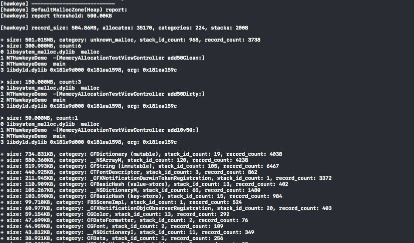
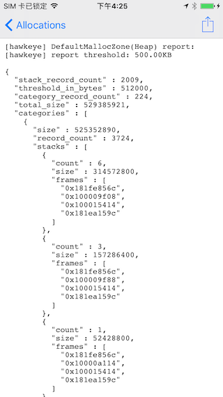
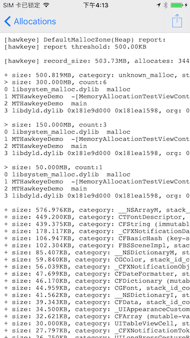

# Hawkeye - Allocations

`Allocations` 类同于 Instrument 的 Allocations 功能，跟踪应用实际分配的内存详情，在应用内存使用异常（异常上升、OOM 退出）时可以通过记录的内存使用详情数据，来排查内存使用问题。

## 0x00 背景

App 上线之后，OOM 导致的应用在前台直接退出没有更多的日志信息，没法拿到更多的内存分配详情，我们很难直接处理这类问题。

针对 OOM 鹅厂发布了两篇博文 [iOS 爆内存问题解决方案](https://juejin.im/post/5a58f1a76fb9a01cab283392), [iOS 微信内存监控](https://mp.weixin.qq.com/s?__biz=MzA3NjA3NTI5Mg==&mid=2656330237&idx=1&sn=30f0ef983229766db955f7f513ea2872&chksm=84c6198eb3b1909869b343e1ac2cfa46a64e8b7b72e47d7ee72282ea855ae124afce999bf16a&mpshare=1&scene=1&srcid=03012ZuanPME6WqDfHRsGgKC&rd2werd=1#wechat_redirect)，前后也开源了两个组件，[OOMDetector](https://github.com/Tencent/OOMDetector) 和 [WeChat - Matrix](https://github.com/Tencent/matrix)。在我们实现 `Allocations` 之前，`Matrix` 还未开源，而 `OOMDetector` 应用到实际项目中还有不少问题，故我们实现了 `Allocations` 组件，用于监控内存的分配和释放。他不仅用于生产环境，同时也用于开发和测试环境。

开发阶段接入后，遇到一些异常的内存使用情况，只需打开开关并重跑一遍操作流程，即可快速查看到详细的存活内存信息。

测试、生产环境中，当 Allocations 开启，遇到一些 OOM 异常退出时，我们可以读取沙盒里记录的最终内存数据，通过这些记录，做内存占用详情的进一步分析。

## 0x01 使用

1. 点击 MTHawkeye 的浮窗进入主面板
2. 点击导航栏 title，呼出 MTHawkeye 面板切换界面
3. 点击切换界面右上角的 `Setting`，进入 MTHawkeye 设置主界面
4. 找到 `Allocations`, 进入开启 `Trace Heap & VM Allocations`
5. 建议退出 App 重新运行程序（不重启的话只会记录开启时间点后的内存分配释放）
6. 执行要测试的流程，执行完成后，去生成并查看报告

## 0x02 查看报告

在 Allocations 已经开启的情况下，需要查看内存占用的时候，有几种方法可以查看：

1. 如果当前为联调状态

进入 Hawkeye 控制台，选择 `Memory - Allocations` 模块，选择 Running Session 的 `Dump Allocations to console in line`。即可把当前运行记录的 allocations 数据生成报告，并输出到 Xcode console 下。示例如下：

2. 生成报告到文件并在 Hawkeye 内直接查看

选择 `Dump Allocations to file in line`，即可以行列的格式在 Hawkeye 内直接查看生成的报告，报告说明见后文。

选择 `Dump Allocations to file in JSON`, 即可以 JSON 格式化字符串的形式在 Hawkeye 内直接查看生成的报告，报告说明见后文。

3. 如果要查看历史运行记录的报告

在 History Sessions 下选择具体的记录（需要当次运行有开启 Allocations）。

4. 如果需要在 Hawkeye 外导出查看
运行完后，拷出沙盒内 `com.meitu.hawkeye/****the-session-time****/allocations/` 目录下的所有文件，一般包含以下文件

- `malloc_records_raw`, memory allocate by `malloc` and not yet `free`.
- `vm_records_raw`, memory allocate by `vmallocate`/`mmap` and not yet `free`.
- `stacks_records_raw`, the stack frame records when allocate memory.
- `dyld-images`, use for further stack frame symbolics.
- `malloc_report`, only exist after `Dump Allocations to file in JSON`, can also be generated by `MTHAllocationsReader`.
- `vm_report`, only exist after `Dump Allocations to file in JSON`, can also be generated by `MTHAllocationsReader`.

拿到这几个文件后，还需要根据三个 `**_records_raw` 和 `dyld-images` 文件生成报告。在 Hawkeye 跟目录下可拿到命令行工具 `MTHAllocationsReader`，（MacOS 下），可来解析原始数据，生成报告。[MTHAllocationsReader 命令说明参考](./allocations-raw-record-reader.md)

### 报告说明

#### JSON 格式

- "stack_record_count", the total count of unique stack frame recorded when allocate memory.
- "threshold_in_bytes", only when the living memory exceed the threshold by that allocate stack, that stack will be output to the report. (see `stacks` object below)
- "category_record_count": the total count of unique categories.
- "total_size": total living memory recorded, in bytes.
- "categories": allocated memory group by category.
  - "name", the category name. would be Objective-C class name if the memory is allocate by OC class. (eg. MALLOC, UIView, NSObject)
  - "stack_id_count", the total count of unique stack frame recorded under that category.
  - "size", total living memory recorded under that category, in bytes.
  - "record_count", total count of memory pointers not freed yet under that category.
  - "stacks", the living memory allocated by these stacks exceeds the `threshold_in_bytes`.
    - "frames", memory allocation stack frame. For symbolics, see [Report Configuration - Remote symbolics](#0x03-report-configuration)
  	- "size", total living memory recorded under that allocate stack, in bytes
  	- "count", total living memory pointers count under that allocate stack

[查看 JSON 格式示例报告](./allocations-report-in-json-demo.txt)

#### 按行输出格式

实际字段与 JSON 格式字段一致，结构一致，只是为了可读性，转成以行的形式的输出。

[查看按行格式输出示例报告](./allocations-report-in-lines-demo.txt)

## 0x03 报告选项

- 修改 `Heap Report Threshold`

`Heap Report Threshold` 值用于控制生成 malloc 存活内存报告时哪些只展示概要信息，哪些同时展示分配调用栈。如默认阈值为 500KB，表示只展示累加占用大于 500KB 内存的分配栈，小于这个值的值展示占用大小。

- 修改 `VM Report Threshold`

类似于 Heap Report Threshold，但是是用于过滤 vm_allocate/mmap 存活内存报告。

- `Category Report Threshold`

过滤 Category 的展示，一些数值较小的不展示在报告中，默认为0，不过滤。

- `Remote symbolics`

如果是 debug 阶段或者程序包未去除符号表，则不需开启 `Remote symbolics`，可直接使用 `Allocations` 主面板进入记录详情页查看符号化后的结果。

其他情况下，如果已经[自己实现了符号化服务](./../hawkeye-remote-symbolics.md)，并做了设置，可打开 `Remote Symbolics`，再查看详情记录时会切换调用远程符号化服务。

若想在程序退出运行后，从沙盒里拿到记录的数据，则需要自己进行符号化。手动操作可按以下步骤：

1. 拿到 hawkeye 存储目录下的 `dyld-images` 文件
2. 拿到待符号化的 stack-frames 数据
3. 拿到运行包对应的符号表文件
4. 针对每一个 stack-frame，找到所在 dyld-image, 使用 atos 命令进行符号化

## 0x04 性能影响

在 iPhone 7, iOS 12.2 测试，进入美图秀秀相机界面，平均 CPU 占用率会升高 5% 左右，占用 12MB mmap 内存。绝大多数 App 的额外 mmap 内存占用峰值也在 12MB 内。
