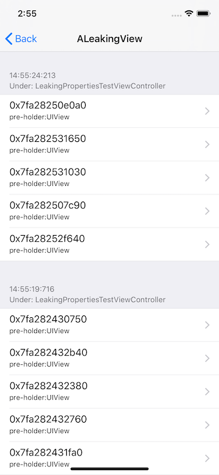
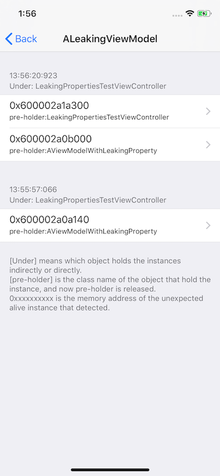

# Hawkeye - Living Objects Sniffer

`Living Objects Sniffer` 用于跟踪观察 ViewController 直接或间接持有的对象和自定义 View 对象，侦测他们是否异常存活（泄露、未及时释放、不必要的内存缓存）

## 0x00 背景

在日常开发过程中，我们一般会借助于自带工具或其他第三方工具来帮助我们排查这类问题，比如：

1. `Xcode+Instrument`，官方排查方案。主要的缺点是相对繁琐，需要单独在 Instrument 开启，我们一般等到一个开发周期的末端再开启统一排查这类问题。

2. `FBMemoryProfiler`，Facebook 团队开源的方案，其中 FBAllocationTracker 通过 hook 所有 ObjC 对象的 alloc, dealloc 方法，来监测当前存活的所有 ObjC 对象。`FBRetainCycleDetecter` 则可针对一个对象遍历搜索可能潜在的循环引用.

3. `MLeaksFinder`，微信读书团队开源的方案。主要用来监测 ViewController 及其 View 的内存未释放问题，有内存泄露时通过Alert弹窗的方式直接提示，交互体验上有改善空间，另外对 ViewController 持有的其他类型属性 (如viewModel, dataManager 之类的)缺少监测机制。

对于 `Living Objects Sniffer`，它分别在 ViewController（它本身和它直接、间接持有的属性）和 View 两个层级进行观察，在对象持有者已释放，但自己还没释放时，放入观察池内。开发者可根据观察池的分组展示，直观的查看存活的对象是否异常。

## 0x01 使用

`Hawkeye` 接入 `Living Objects Sniffer` 模块后，启动 Hawkeye 会默认开启监测，如果需要关闭可按以下步骤操作：

1. 点击 Hawkeye 的浮窗进入主面板
2. 点击导航栏 title，呼出 Hawkeye 面板切换界面
3. 点击切换界面右上角的 `Setting`，进入 Hawkeye 设置主界面
4. 进入`Living Objects Sniffer`模块设置

## 0x02 规则、异常提示及交互处理

`Living Objects Sniffer UI` 提供两种警告方式，告知开发者一些异常的存活对象：

- 在 Hawkeye 悬浮窗，以红白交替闪烁**内存插件**的形式。此时点击浮窗可直接跳到异常存活对象池
- 从顶部弹出 Toast 浮层提示具体异常存活的对象。


### 默认警告规则

`Living Objects Sniffer UI` 加入到 `MTHawkeyeUIClient` 后，会在侦测到异常对象的时候，根据以下规则触发警告提示

- 如果一个类第一次被侦测到有异常存活对象，忽略
- 如果一个类被侦测到的对象里有共享对象，忽略
- 如果侦测到的对象是 ViewController，弹出 Toast 提示异常存活对象（可关闭）
- 如果侦测到的对象是 TableViewCell/CollectionViewCell，且异常存活对象数量大于指定值（默认20），闪烁悬浮窗提示异常存活
- 如果侦测到的对象是其他类型，闪烁悬浮窗提示异常存活

### 自定义警告规则

如果不想要 `Living Objects Sniffer UI` 默认的警告提示，可实现 `MTHLivingObjectSnifferDelegate` 协议定制自己的规则进行提示。

### 异常存活对象池

进入 Hawkeye 主面板 `Meory Records`中`Unexcepted living instances`，可查看当前侦测到的所有异常存活对象。（在内存浮窗红白闪烁提示时，点击浮窗可快捷进入）


1. [living: n] 表示检测到 n 个异常存活的对象。
2. [shared: n] 表示这个类的异常对象中有 n 个异常对象被多次检测到，意味着他一定被其他对象持有，算作共享对象。

对于 `shared` 类型的对象，如果没有持续上升，主要看是否有持续存活的必要，其他可忽略不做处理。

而 `living` 类型，如果有较多的对象，且未释放对象持续上升没有下降，一般就是内存使用有问题，需要进一步排查。

### 查看按时间分组的存活对象详情

点击任意存活类型，进入到以时间为单位分组的详情界面。这里的的时间区间以 ViewController 退出的时间为锚点进行分组，一个分组下的对象，表示他们被侦测的时间是在所在 ViewController 退出期间。`Under` 信息表示了触发侦测时的 ViewController。

如果每次 ViewController 退出都有新的该类型未释放对象，一般内存使用上有问题，需要进一步排查。

 

## 0x03 存储说明

`Living Object Sniffer Hawkeye Adaptor` 启动后，异常存活对象池数据会存储到本地，存放地址为 `/Document/com.meitu.hawkeye/{{session-time}}/alive-objc-obj.mtlog`, 内容格式为 JSON 字符串。以下为字符串字段说明：

- `begin_date`: App launched time
- `end_date`: Records write time
- `alive_instances_collect`: the living objects pool
  - `class_name`: class name of the living objects
  - `alive_instance_count`: count of the living objects
  - `is_a_cell`: the living object is a TableViewCell/CollectionViewCell
  - `instances`: the living objects
    - `pre_holder_name`: when detected start, the holder object's class name
    - `instance`: the memory address of the living object
    - `time`: the time when detect happened
    - `not_owner`: it's been detected that hold by different objects, count as `shared objects`.

示例:

```json
{
  "begin_date": "1553593254.858878",
  "end_date": "1553593593.199498",
  "alive_instances_collect": [
    {
      "class_name": "ALeakingModel",
      "instances": [
        {
          "instance": "0x109b07e40",
          "not_owner": false,
          "pre_holder_name": "",
          "time": "575286369.316304"
        }
      ],
      "is_a_cell": false,
      "alive_instance_count": "1"
    },
    {
      "class_name": "AnotherLeakingModel",
      "instances": [
        {
          "instance": "0x2822b1ad0",
          "not_owner": false,
          "pre_holder_name": "TestViewController",
          "time": "575286351.858492"
        }
      ],
      "is_a_cell": false,
      "alive_instance_count": "1"
    }
  ]
}
```

## 0x04 性能影响

`LivingObjectsSniffer` 开启后，主要的性能影响点在退出控制器时在生成 shadow 对象里的遍历所有引用元素操作，具体见代码里的 `MTHSignpostStart(510), MTHSignpostEnd(510)` 和 `MTHSignpostStart(511), MTHSignpostEnd(511)`，在开启遍历容器内元素时，会加大性能影响。

| iPhone 6s 10.3.2 Release | average (510) | max (510) |
| --- | --- | --- |
| Container Sniffer off | 1.12ms | 3.39ms  |
| Container Sniffer on | 2.74ms | 89ms |

最大的耗时发生在一个复杂控制器退出时，过滤掉系统控制器后，总共遍历了 1567 个对象（额外开启了容器遍历，关闭时这个控制器的额外耗时为 3.39 ms），整体耗时 89 ms。大部分的控制器基本在 100 个对象以内，耗时在 3ms 以下。

> NSFoundation 容器遍历默认为关闭状态
