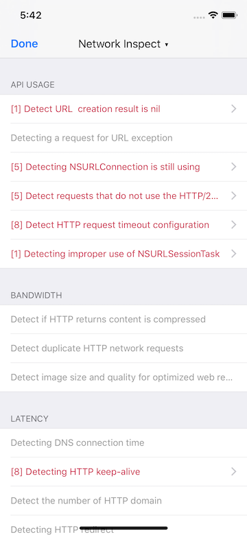
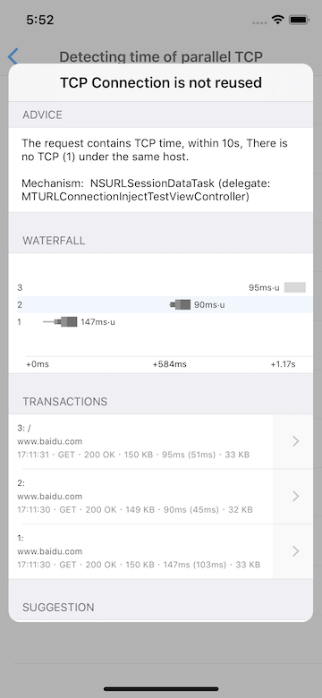

# Hawkeye - Network Inspect

`NetworkInspect` is based on `NetworkMonitor`. Depending on the actual of the network transaction, checking whether the network request can be improved according to the inspection rules, and your can add your own inspection rules by yourself.

## 0x00 The Rule

The built-in inspect rules:

- API Usage
  - Detecting URL creation result is nil
  - Detecting URL exceptions for the request
  - Detecting the use of deprecated NSURLConnection API
  - Detecting has not yet use HTTP/2
  - Detecting the use of default timeout
  - Detecting improper use of NSURLSessionTask
- Bandwidth
  - Detecting if response body is compressed
  - Detecting duplicate network transactions
- Latency
  - Detecting DNS connection time
  - Detecting HTTP too much extra time cost cause of redirects
  - Detecting HTTP keep-alive not used
  - Detecting use too many second-level domains
- Scheduling
  - Detecting heavy requests during startup (> 1.5s)
  - Detecting long DNS cost during startup (200ms)
  - Detecting long TCP shake-hand during startup
  - Detecting HTTP task priority management
  - Detecting time used by parallel TCP shake-hands

for the strategies for network development, refer [iOS Network Practice](./network-practice.md).

You can add your own inspection yourself:

```objc
MTHNetworkTaskInspection *inspection = xxx;
[MTHNetworkTaskInspector addInspection:inspection];
```

## 0x01 Usage

After add `Network Monitor` to `MTHawkeyeClient`, `Network Monitor` will start after MTHawkeye run by default, it will do the inspect will you open the `Network Monitor` / `Network Inspect` panel, you can close it by following steps:

1. Tap MTHawkeye floating window, enter the main panel.
2. Tap navigation title view, show the MTHawkeye panel switching view.
3. Tap `Setting` in the upper right corner of the switching view, enter the Setting view home.
4. Find `Network Montor`

 
