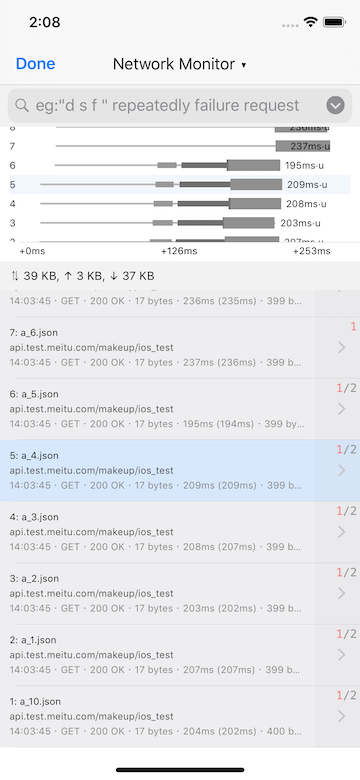
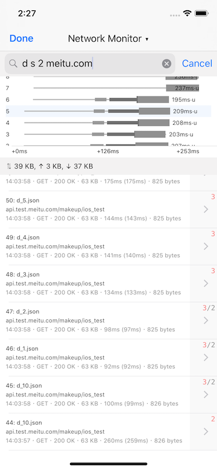
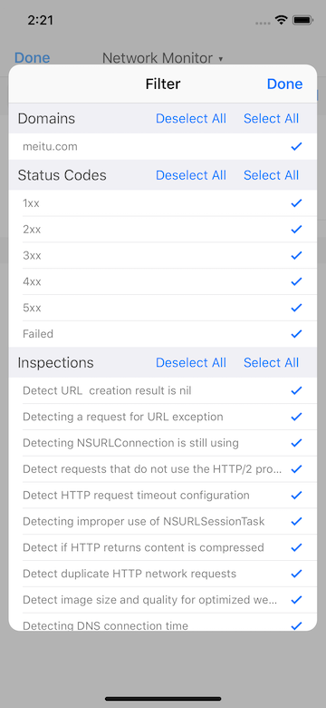
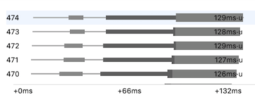
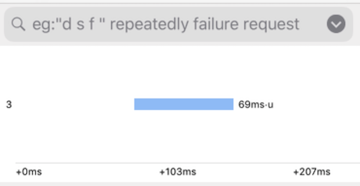
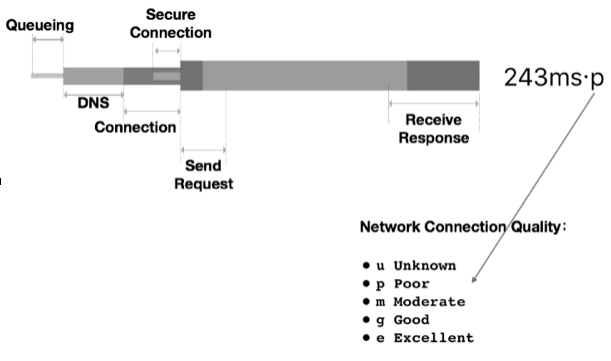
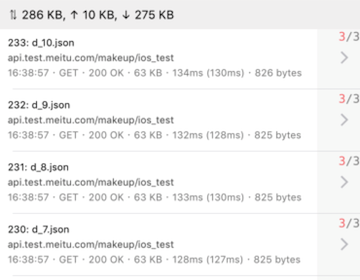
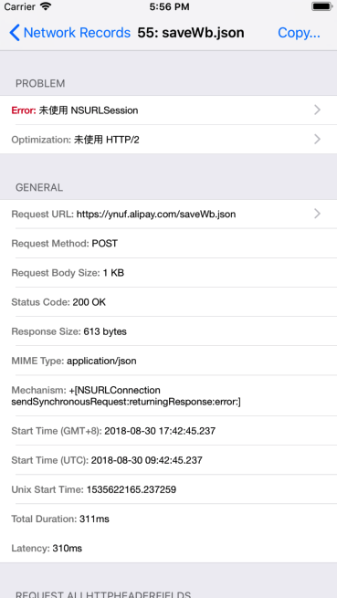
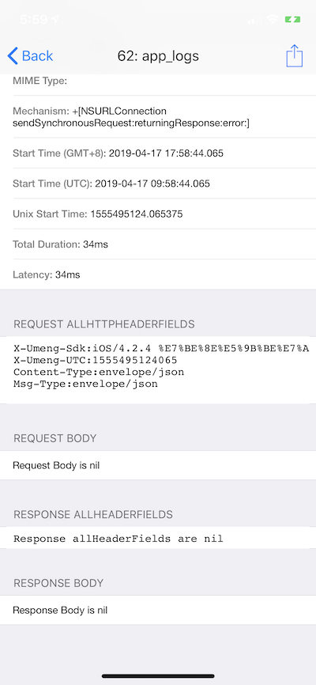

# Hawkeye - Network Monitor

`NetworkMonitor` observe and records HTTP(S) network transactions with metrics info in the App. Providing a built-in records viewing interface for developer to troubleshoot network problems.

## 0x00 Background

During development, we check the specific network transactions for troubleshooting by following ways:

1. Log + breakpoints debugging
2. Set proxy and use Apps like `Charles`, `WireShark`
3. Import `FLEX` in App for DEBUG.

Sometimes `FLEX` would be the most convenient, but it still need some improvement to fit more scenarios. Presently, `Network Monitor` has done:

1. Inherit FLEX's network recording logics, and optimize the initialization logic, greatly reducing the impact by hooking on startup time.
2. For NSURLSession after iOS 9, add the URLSessionTaskMetrics record to view the time of each stage of the transaction.
3. Add a waterfall view similar to Chrome network debugging based on transaction metrics, to view the queue and parallel of network transactions, and do further optimization.
4. Add the ability to detect duplicate unnecessary network transactions.
5. Enhanced search bar to support multi-condition search (host filter, status filter)
6. Record the network transaction with request header, request body, response body.

## 0x01 Usage

After add `Network Monitor` to `MTHawkeyeClient`, `Network Monitor` will start after MTHawkeye run by default, you can close it by following steps:

1. Tap MTHawkeye floating window, enter the main panel.
2. Tap navigation title view, show the MTHawkeye panel switching view.
3. Tap `Setting` in the upper right corner of the switching view, enter the Setting view home.
4. Find `Network Monitor`

### Interface & Interaction

#### Transaction Record History

The main interface of the network transactions history contains three major parts, from top to bottom:

* Search bar, filter configuration (example centered below, example right below).
* The waterfall view of the currently selected request and its parallel requests.
* History transaction record list.

The search bar supports simple filter parameters.

* `d`, filter the all duplicate network transactions
* `s 1/2/3/4/5/f`, used to filter the response status, such as `s 4` to show all the 4xx response, `s f` to show all failed response.
* `url filter`, for url match.

As example, input `d s f meitu.com` means show all the failed response and are duplicated with the url contains meitu.com.

To the right of the search bar, `Filter` button is used as visual editing panel.

##### Waterfall for parallel network transactions

Between the search bar and the transaction records tableview is the waterfall view. When a network transaction record in the table is selected, all the network transactions in parallel in time.

At the bottom of the waterfall is the timeline, which indicate the duration of the showing transactions. For each row, the transaction index on the left, corresponding to those in the transaction record history tableview. There are two display style for the network transaction in waterfall row, one for the transaction containing the `URLSessionTaskMetrics` data (below left) and one for those without it (below right).

 

The different thicknesses on the left example representing multiple stage of a network transaction, as explained below:

* `Queueing`: request task queuing duration
* `DNS`: DNS duration.
* `Connection`: TCP handshake duration.
* `Secure Connection`: TLS handshake duration for HTTPS.
* `Send Request`: Time from the first HTTP package send to the last package send out.
* `Receive Response`: Time from the first HTTP package receive to the last package received
* The letter after each transaction record's representing the quality that time:
  * `u` (unknown): Not enough records for estimate (< 3)
  * `p` (poor): < 150 kbps
  * `m` (moderate): 150 ~ 550 kbps
  * `g` (good): 550 ~ 2000 kbps
  * `e` (excellent): > 2000 kbps

> For the detail of  quality of the transactions, see `MTHawkeyeNetworkExponentialGeometricAverage`

For the detail duration, you can view it in the network transaction detail view.

> While the transaction contains redirect, only the full detail of the last part will be displayed on the view.

##### Transaction record history tableview

The transaction records will show in tableview, with a section header records the payload size of all the request. For each row

* The label at the beginning shows the `transaction index: url.lastPathComponent + query`. If the transaction failed, the label is red.
* The middle label shows the `url.host + url.paths.trimLast`
* The bottom label show `transaction initiation time · HTTP method · HTTP status · duration · packet size (request + response)`
* The cell background color (`light blue`: current focused, `light gray`: parallel transactions with the light blue, `white`: others).
* The gray square on the right, may show `*/*/*` as the number of advices inspected by [Network Inspect](./network-inspect.md) module.

#### Transaction record detail

The details of transaction record is divided into several sections:

* `Advice`: Improvement suggestions from Network Inspect
* `General`: The summary of the transaction
* `Request`: Request AllHTTPHeaderFields & Request Body
* `Response`: Response AllHTTPHeaderFields & Response Body

The record detail can be exported by using the `Copy` and `AirDrop`.

 
