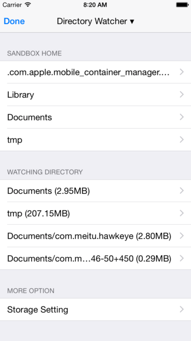
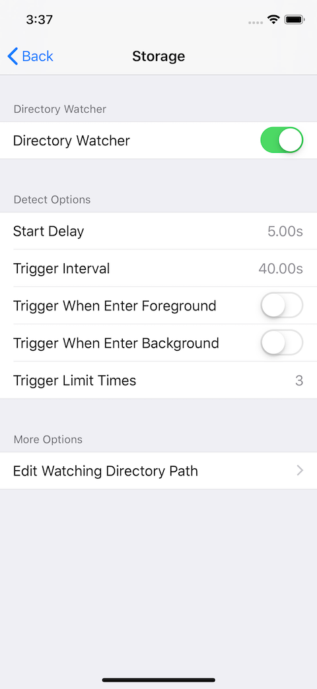

# Hawkeye - Directory Watcher

`DirectoryWatcher` is used to track the size of the specified sandbox folders, it also integrates FLEX's sandbox file browser and extends the use of AirDrop for files.

## 0x00 Usage

1. Tap MTHawkeye floating window, enter the main panel.
2. Tap navigation title view, show the MTHawkeye panel switching view.
3. Choose `Storage` -> `Directory Watcher`, view the panel

## 0x01 Rules

`Directory Watcher` can monitor the size of the specified folders according to the configuration, and notify the developer when exceeding the preset value (default 200MB):

- By default, the first detection starts 5 seconds after the module is started.
- After that, the detection will be triggered every 40s by default.
- After the count of detection reach specified value (default 3), the monitor will stop.
- Able to enable detection once when enter background.
- Able to enable detection once when enter foreground.

## 0x02 Configuration

1. Tap MTHawkeye floating window, enter the main panel.
2. Tap navigation title view, show the MTHawkeye panel switching view.
3. Tap `Setting` in the upper right corner of the switching view, enter the Setting view home.
4. Find `Directory Watcher` under `Storage`

