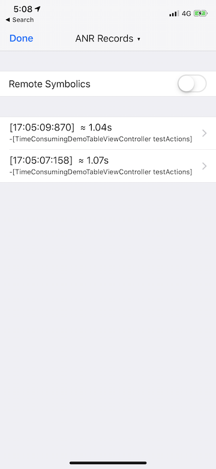
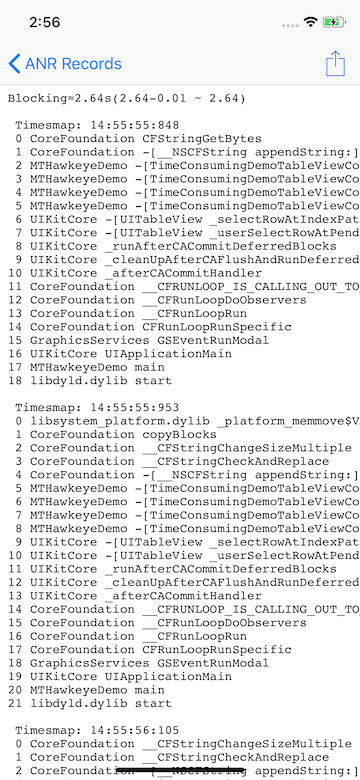

# Hawkeye - ANR Trace

`ANR Trace` is used to capture the main thread block event, and will sampling the main thread stack frame when the jam occurs.

## 0x00 Usage

After add `ANR Trace` to `MTHawkeyeClient`, by default it'll start after `MTHawkeyeClient` run, you can change it by following steps:

1. Tap MTHawkeye floating window, enter the main panel.
2. Tap navigation title view, show the MTHawkeye panel switching view.
3. Tap `Setting` in the upper right corner of the switching view, enter the Setting view home.
4. Find `TimeConsuming` and go to `ANR Trace`, turn off `Trace ANR`, configure `ANR Threshold`

## 0x01 Record block event

When a method executed on main thread takes longer than the specified threshold (the default is 400ms), `ANR Trace` will capture a block event, and sampling the stack frame of main thread. You can see the recorded block events and details within the App while development.

 

If you need a accurate duration time while blocking and the detail calls, consider using [UI Time Profiler](./ui-time-profiler.md)

## 0x02 Storage

ANR records is store under [Records file](./../hawkeye-storage.md#0x02-built-in-plugin-data-storage-instructions). Use a `collection` name `anr`, `key` as the time block event generated, `value` is a JSON string with the following fields:

- `time`: the time block event generated
- `duration`: the rough duration of blocking
- `stackframes`: sampling stack frame when the block event captured (symbolic needed), hexadecimal address string separated by `,`

examples:

```json
{
    "stackframes":"0x1b050d908,0x1b05091fb,0x1b05091fb,0x1b043a15b,0x1029f1013,0x1029f0ccf,0x1029f0727,0x1029f0653,0x1dd932457,0x1dd9326bb,0x1dd73087b,0x1dd71e877,0x1dd74d87f,0x1b04dc7cb,0x1b04d745f,0x1b04d79ff",
    "time":1553593555.7076001,
    "duration":"1009.450078010559"
}
```

## 0x03 Symbolics

`ANR Trace` records raw stack frame need to symbolized for reading.

If the running App do have DWARF within, you can directly use `ANR Trace` panel to view the symbolized result generated internal.

In other cases, if you have your own [remote symbolization service](./../hawkeye-remote-symbolics.md) and did set, switch on the `Remote Symbolics`, and then you can view the symbolized stack frame directly in the App.

If you wanna get the raw data from the sandbox, manual symbolize yourself as follows:

1. Get the `dyld-images` file in the MTHawkeye storage directory.
2. Get the raw stack frame data from the records.
3. Get the `dSYM` files
4. for each `frame`
    - find the match `dyld-image` by `frame` value, then match a `dSYM` file.
    - Use `atos` command to symbolize the `frame`.
