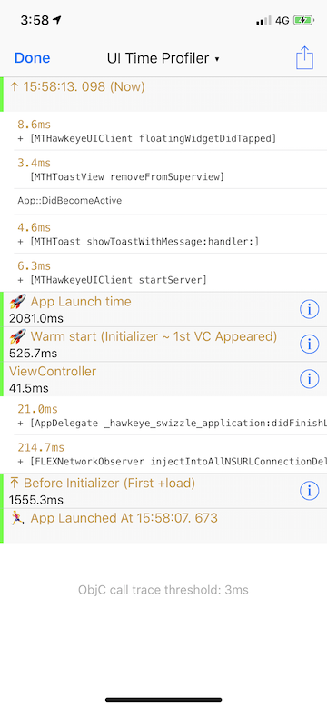
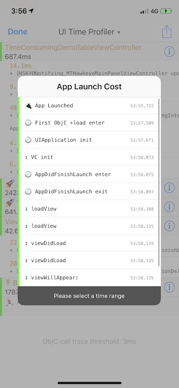
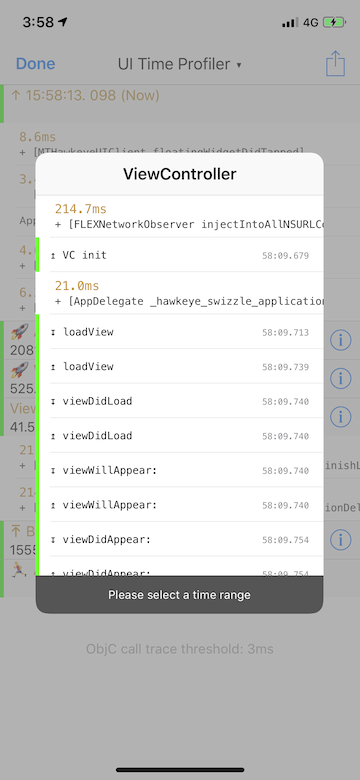
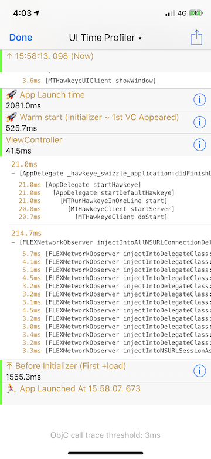
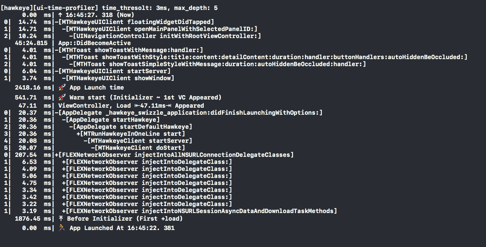

# Hawkeye - UI Time Profiler

`UI Time Profile` is used to assist in optimization of time-consuming tasks of the main thread, including startup, page opening, and key operational procedures.

## 0x00 Background

In daily development, when we profiling time performance, there are several ways we are using.

1. Use Instrument Time Profiler. It's powerful, but sometimes the result is not intuitive. For example, if the there is a synchronous network request on main thread, not the whole duration will be counted in Time Profiler while the actual time of the main thread blocked will be much longer.

2. Use a third-party component, such us [BLStopwatch](https://github.com/beiliao-mobile/BLStopwatch), we use it to insert anchor points among the code, and then display the time between anchor points in a certain period of time. But you need to add code for each points and care for not affect the online version.

3. Use [Instrument System Trace](https://developer.apple.com/videos/play/wwdc2016/411/) to analyze the detailed time consumption, it is suitable for use in fine analysis.

In some scenarios, we can't use the above tools conveniently, and there is no way to meet the requirements of automated tacking. We need a more convenient tool to help us track the time-consuming situation, this is what `UITimeProfier` has to do.

## 0x01 Usage

`UI Time Profiler` divided into two parts. After add to MTHawkeyeClient, the first part is enabled by default, which is mainly used to track the time taken for startup and ViewController opening. The second part is turned off by default, is used to track all the `Objective-C` methods execution on the main thread when the time cost over the given threshold. If you need to turn it off or on, follow steps:

1. Tap MTHawkeye floating window, enter the main panel.
2. Tap navigation title view, show the MTHawkeye panel switching view.
3. Tap `Setting` in the upper right corner of the switching view, enter the Setting view home.
4. Find `TimeConsuming` and go to `UI Time Profiler`
    - `Trace VC Life` for tracking overall time-consuming, ViewController display time-consuming.
    - `Trace ObjC Call` for tracking long time-consuming `Objective-C` methods executed on the main thread. (only for device)

In addition to the time records capture by these two modules, you can call the API in `MTHTimeIntervalRecorder.h` to insert your own anchor time points, the anchor you insert will be integrated in the result `UITTimeProfiler` view.

```objc
[[MTHTimeIntervalRecorder shared] recordCustomEvent:@"web init"];

[[MTHTimeIntervalRecorder shared] recordCustomEvent:@"web request start" time:1555052516];

[[MTHTimeIntervalRecorder shared] recordCustomEvent:@"web did load" extra:@"{xxxxx}"];
```

## 0x02 Interface & Interaction

The record display view can divided into three parts:

### UITimeProfiler main view

The main view is shown in section-rows, reversed by time(the sections are in light gray background, and the rows are in white background). The section may be the key time node of the App launch process, or the ViewController didAppeared time. The row under the section is all the time events between the two sections in time.

Section, reversed by time:

- `↑ %@ (Now)`: the time open the UITimeProfiler view.
- ...
- `***ViewController`: indicates that the time cost to display this ViewController
- ...
- `🚀 App Launch time`: Time takes from the App process create to the first ViewController didAppeared complete.
- `🚀 Warm start (Initializer ~ 1st VC Appeared)`: Time takes from MTHawkeye `+load` to the first ViewController didAppeared complete.
- `⤒ Before Initializer (First +load)`: Time takes from the App process create to MTHawkeye `+load` invoked.
- `🏃 App Launched At`: The creation time of the App process.

App lifecycle record points:

- `App::WillEnterForeground`: `UIApplicationWillEnterForegroundNotification`
- `App::DidBecomeActive`:  `UIApplicationDidBecomeActiveNotification`
- `App::DidEnterBackground`: `UIApplicationDidEnterBackgroundNotification`



> `ViewController 41.5ms` means that the time cost for displaying ViewController cost 41.5ms, tap detail button on right to see the details of each stage.
>
> The section contains two rows, the time cost is 21ms and 214.7ms respectively. They occur before the ViewController didAppear completion time, some of them may or may not occur during the appearing process.

### App launch time-consuming details / VC display time-consuming details view

For the section, tap the detail icon on the right to view the details, with the following fields:

- `AppDidLaunch Enter`：`application:didFinishLaunchingWithOptions` entry point
- `AppDidLaunch Exit`：`application:didFinishLaunchingWithOptions` exit point
- `↥ VC init`: the time end of the ViewController create.
- `↧ loadView` & `↥ loadView`: the ViewController `loadView` entry and exit time points.
- `↧ viewDidLoad` & `↥ viewDidLoad`: the ViewController `viewDidLoad` entry and exit time points.
- `↧ viewWillAppear:` & `↥ viewWillAppear:`: the ViewController `viewWillAppear:` entry and exit time points.
- `↧ viewDidAppear:` & `↥ viewDidAppear:`: the ViewController `viewDidAppear:` entry and exit time points.

examples:

 

### Long time-consuming Objective-C method records on main thread

When `Trace Objc Call` turned on, it would record the Objective-C methods that takes longer than the threshold (default 10ms) on main thread.



### Export records

You can directly top the button on the upper right of the `UI Time Profiler` view, dump the log to Xcode console, or share it via Airdrop.



## 0x03 Storage

After the plugin is connected to MTHawkeyeClient, the new time record will be store in [Records file](./../hawkeye-storage.md#0x02-built-in-plugin-data-storage-instructions), including the following types of data:

### App Launch time-consuming records

there is only one record for app launch time-consuming, the `collection` name is `app-launch`, `key` is "0", and `value` as JSON string with the following fields:

```txt
{
  "appLaunchTime" : 1533019689.050308,             // App launch time
  "firstObjcLoadStartTime": 1533019689.050308,     // MTHawkeye +load method been invoked
  "lastObjcLoadEndTime": 1533019689.050308,        // the last +load method been invoked, not available yet
  "staticInitializerStartTime": 1533019689.050308, // C++ static variable initialization start, not available yet
  "staticInitializerEndTime": 1533019689.050308,   // C++ static variable initialization end, not available yet
  "applicationInitTime" : 1533019694.4675779,      // UIApplication init
  "appDidLaunchEnterTime" : 1533019695.0537369,    // entry application:didFinishLaunchingWithOptions:
  "appDidLaunchExitTime" : 1533019695.082288       // exit application:didFinishLaunchingWithOptions:
}
```

### ViewController display time-consuming records

When a ViewController appeared, it will generate record. uses a `collection` name `view-ctrl`, `key` is an incremental subscript starting from 0, and the `value` is JSON string with the following fields:

```txt
{
  "initExitTime" : 1533018427.0977719,           // VC -init exit, can be 0 (opened the same VC several times)
  "loadViewEnter" : 1533018427.1496551,          // VC -loadView entry, can be 0
  "loadViewTime" : 1533018427.155427,            // VC -loadView exit, can be 0
  "didLoadEnter" : 1533018427.1554639,           // VC -viewDidLoad entry, can be 0
  "didLoadTime" : 1533018427.1662569,            // VC -viewDidLoad exit, can be 0
  "willAppearEnter" : 1533018427.166456,         // VC -viewWillAppear: entry
  "willAppearTime" : 1533018427.166533,          // VC -viewWillAppear: exit
  "didAppearEnter" : 1533018427.194926,          // VC -viewDidAppear: entry
  "didAppearTime" : 1533018427.195226,           // VC -viewDidAppear: exit (completed)
  "name" : "FacebookProjectsTableViewController" // the VC name.
}
```

### Custom events records

Custom event storage uses a `collection` named `custom-time-event`, key is the recording time point, and the value is JSON string with the following fields:

```txt
{
  "time": 1533018427.0977719,       // the time event record
  "event": "event name",            // event name，refer [[MTHTimeIntervalRecorder shared] recordCustomEvent:event extra:extra];
  "extra": "event extra info"       // event extra info.
}
```

The plugin contains three built-in custom events:

- `App::WillEnterForeground`
- `App::DidEnterBackground`
- `App::DidBecomeActive`

### Long time-consuming Objective-C method records on main thread

the `collection` name is `call-trace`. `key` is an incremental subscript starting from 0, each record corresponds to a method call time cost, `value` is a JSON string with the following fields:

```txt
{
  "class": "MTHawkeyeClient",  // the method's class name
  "method": "start",           // the method's name
  "cost": "135.02",            // time cost by the method, in ms
  "time": "1510970411.322888", // the time method exit, unix time
  "depth: "0"                  // the call level of the method, starts at 0.
}
```

Because the list of recorded methods is executed serially by the main thread, and fetch the list order by time, use the depth info, you can printed in a more intuitive format as below:

```sh
 0| 178.33  ms|-[ClassAAA] applyCurrentFilterEffectShowTips:]
 1| 135.02  ms|  -[NSKVONotifying_xxxxx xxxxxx]
 2| 135.01  ms|    -[NSKVONotifying_xxxxx startXZx]
 3| 134.95  ms|      -[AVCaptureSession startRunning]
 0|  56.61  ms|-[XXXXYrManager setxxxxxx:]
 0| 451.25  ms|-[_UIViewControllerOneToOneTransitionContext completeTransition:]
 1| 430.78  ms|  -[ClassAAA configureXXXXXAnimation:]
 2| 412.83  ms|    -[ClassAAA xxxxxhowRect:preViewSize:]
 3| 412.60  ms|      -[ClassAAA xxxxProcessTool]
 0| 195.64  ms|-[UIView layoutIfNeeded]
 0|  64.24  ms|-[ClassAAA setupXXX]
 0|  70.74  ms|-[ClassAAA setupSubviews]
```
