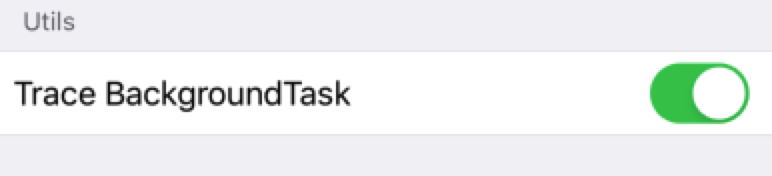

#  Hawkeye - Background Task Trace
在我们内部自动化测试实践过程中偶有出现`0xbada5e47`这个异常崩溃代码，针对于这个问题Hawkeye开发了`Background Task Trace`这个插件用于跟踪系统中后台任务调用流程。对于一些后台任务导致的异常崩溃可以参考[这篇文章](https://mp.weixin.qq.com/s/MW02G1qiyce9v2cRYHCzLQ)。

## 0x00 使用
`BackgroundTask Trace`模块在Hawkeye中是默认不引入的，需要在Hawkeye插件注册函数中注册这个模块：
```
MTHBackgroundTaskTraceAdaptor *backgroundTrace = [MTHBackgroundTaskTraceAdaptor new];
MTHBackgroundTaskTraceHawkeyeUI *backgroundTraceUI = [MTHBackgroundTaskTraceHawkeyeUI new];

[[MTHawkeyeClient shared] setPluginsSetupHandler:^(NSMutableArray<id<MTHawkeyePlugin>> *_Nonnull plugins) {
    [MTHawkeyeDefaultPlugins addDefaultClientPluginsInto:plugins];
    
    // add your additional plugins here.
    [plugins addObject:backgroundTrace];
} pluginsCleanHandler:^(NSMutableArray<id<MTHawkeyePlugin>> *_Nonnull plugins) {
    // if you don't want to free plugins memory, remove this line.
    [MTHawkeyeDefaultPlugins cleanDefaultClientPluginsFrom:plugins];

    // clean your additional plugins if need.
    [plugins removeObject:backgroundTrace];
}];

[[MTHawkeyeUIClient shared] setPluginsSetupHandler:^(NSMutableArray<id<MTHawkeyeMainPanelPlugin>> *_Nonnull mainPanelPlugins, NSMutableArray<id<MTHawkeyeFloatingWidgetPlugin>> *_Nonnull floatingWidgetPlugins, NSMutableArray<id<MTHawkeyeSettingUIPlugin>> *_Nonnull defaultSettingUIPluginsInto) {
    [MTHawkeyeDefaultPlugins addDefaultUIClientMainPanelPluginsInto:mainPanelPlugins
                                    defaultFloatingWidgetsPluginsInto:floatingWidgetPlugins
                                                defaultSettingUIPluginsInto:defaultSettingUIPluginsInto];

    // add your additional plugins here.
    [defaultSettingUIPluginsInto addObject:backgroundTraceUI];
} pluginsCleanHandler:^(NSMutableArray<id<MTHawkeyeMainPanelPlugin>> *_Nonnull mainPanelPlugins, NSMutableArray<id<MTHawkeyeFloatingWidgetPlugin>> *_Nonnull floatingWidgetPlugins, NSMutableArray<id<MTHawkeyeSettingUIPlugin>> *_Nonnull defaultSettingUIPluginsInto) {
    // if you don't want to free plugins memory, remove this line.
    [MTHawkeyeDefaultPlugins cleanDefaultUIClientMainPanelPluginsFrom:mainPanelPlugins
                                            defaultFloatingWidgetsPluginsFrom:floatingWidgetPlugins
                                                  defaultSettingUIPluginsFrom:defaultSettingUIPluginsInto];

    // clean your additional plugins if need.
    [defaultSettingUIPluginsInto addObject:backgroundTraceUI];
}];
```

如果注册了这个插件后将默认开启，需要关闭可以到Setting中将这个插件关闭。


# 0x01 数据读取
当我们收到一个`0xbada5e47`的异常crash的时候，可以到Hawkeye的存储目录下`backgroundTasks.mtlog`文件查看信息。其中的数据字段含义：
* `begin_date`：这些后台任务注册的开始时间戳。
* `end_date`：异常的时间戳。
* `backgroundTasks`：当前所有后台任务信息。
* `key`：一个堆栈的前五个地址作为Key值。
* `taskName`: 向系统提供后台任务的名称。
* `beginTaskCount`: 后台任务开始时这个堆栈包含的后台任务数量。
* `endTaskCount`: 后台任务结束时这个堆栈包含的后台任务数量。
* `taskID`: 这个堆栈下包含几个后台任务的id。
* `stackFrames`: 详细的堆栈信息。

```
{
    "begin_date" : xxx
    "end_date" : xxx
    "backgroundTasks" : 
    [
        {
            key : "stackframe[0] - [5]"
            value : {
            "taskName": "",
            "beginTaskCount": 100,
            "endTaskCount": 100,
            "taskID": [1,2,3,4,5,6],
            "titleFrame": "0x4637569578",
            "stackFrames": [
                "0x4637569578",
                "0x4637583148",
                "0x4563199212",
                "0x4564652916",
                ……
            ]}
        },
        {
            key : "stackframe[6] - [10]"
            value : {
               "taskName": "",
               "taskID": [7,8,9,10,11],
               "beginTaskCount": 100, 
               "endTaskCount": 100,
               "stackFrames": [
               		"0x4637569578",
               		"0x4637583148",
               		"0x4563199212",
               		"0x4564652916",
               		……
               ]}
        }
}
```
可以根据保存下来的countIdentifier值验证是否后台任务数超过限制，导致`0xbada5e47`崩溃。

可以根据记录`NSArray <backgroundTaskInfo *>`数组查看后台任务开始和结束的时候数量是否配对，若未匹配可能导致`0x8badf00d`崩溃。

# 0x02 实现原理
通过MethodSwizzling目前开放出来的三个`UIApplication - BackgroundTask`方法实现监听后台任务的调用流程：
```
- (UIBackgroundTaskIdentifier)beginBackgroundTaskWithExpirationHandler:(void(^ __nullable)(void))handler  API_AVAILABLE(ios(4.0)) NS_REQUIRES_SUPER;
- (UIBackgroundTaskIdentifier)beginBackgroundTaskWithName:(nullable NSString *)taskName expirationHandler:(void(^ __nullable)(void))handler API_AVAILABLE(ios(7.0)) NS_REQUIRES_SUPER;
- (void)endBackgroundTask:(UIBackgroundTaskIdentifier)identifier API_AVAILABLE(ios(4.0)) NS_REQUIRES_SUPER;
```
在关于这三个后台任务接口的使用过程中应该注意以下几点：
1. beginBackgroundTask(expirationHandler)实际上并不启动任何任务，而是告诉系统您正在后台执行某些工作。您仍然必须编写代码来创建和管理该工作。 

2. 必须结束开始的每个后台任务。如果不这样做，程序会被watchdog杀死。（无法结束后台任务是造成后台问题的首要原因）我建议你做附加名来启动每个后台任务（通过调用beginBackgroundTask(withName:expirationHandler: )而不是beginBackgroundTask(expirationHandler:) 

3. 后台任务可以通过以下两种方式之一结束：
    * 当您的应用完成后。
    * 当系统调用任务的到期处理程序时。
    您的代码负责在两种情况下调用endBackgroundTask。

1. 后台任务的执行Block里面的调用必须遵循：所有后台任务都必须具有到期处理程序，系统可以使用该处理程序“调用”任务。后台任务API允许系统随时执行此操作，这只是一个清理问题。它必须快速完成，不到一秒左右。如果花费太长时间，您的应用程序将被看门狗杀死。您的到期处理程序需要在主线程上调用。
    
2. UIApplication的`backgroundTimeRemaining`属性。您可以粗略估计可用的时间量。`backgroundTimeRemaining`的返回的值是估计值，可以随时更改。无论返回的值如何，您都必须将应用程序设计为正常运行。使用此属性进行调试是合理的，但我们建议您避免将其用作应用程序逻辑的一部分。

3. iOS 11引入了对进程可以拥有的后台任务断言数量的硬限制（目前约为1000，但具体值可能在将来发生变化）。如果您看到包含异常代码`0xbada5e47`的崩溃报告，那么您已达到该限制。注意您最有可能采取的实际限制是呼叫到期处理程序所需的时间。看门狗对完成任务所花费的总时间有严格的限制（几秒）。如果您有数千个处理程序，您可能会达到此限制。