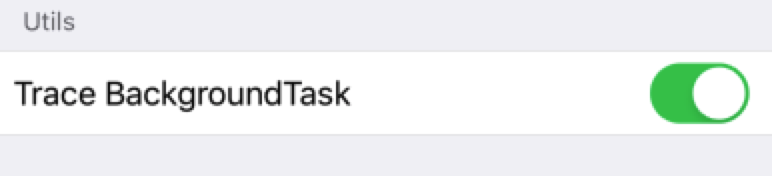

#  Hawkeye - Background Task Trace
In our internal automated testing practice, there is an occasional crash code of `0xbada5e47`. For this problem, Hawkeye developed the `Background Task Trace` plugin to track the background task call flow in the system. For some abnormal crashes caused by background tasks, you can refer to [this article](https://mp.weixin.qq.com/s/MW02G1qiyce9v2cRYHCzLQ).

## 0x00 使用
The `BackgroundTask Trace` module is not introduced by default in Hawkeye. You need to register this module in the Hawkeye plugin registration function：
```
MTHBackgroundTaskTraceAdaptor *backgroundTrace = [MTHBackgroundTaskTraceAdaptor new];
MTHBackgroundTaskTraceHawkeyeUI *backgroundTraceUI = [MTHBackgroundTaskTraceHawkeyeUI new];

[[MTHawkeyeClient shared] setPluginsSetupHandler:^(NSMutableArray<id<MTHawkeyePlugin>> *_Nonnull plugins) {
    [MTHawkeyeDefaultPlugins addDefaultClientPluginsInto:plugins];
    
    // add your additional plugins here.
    [plugins addObject:backgroundTrace];
} pluginsCleanHandler:^(NSMutableArray<id<MTHawkeyePlugin>> *_Nonnull plugins) {
    // if you don't want to free plugins memory, remove this line.
    [MTHawkeyeDefaultPlugins cleanDefaultClientPluginsFrom:plugins];

    // clean your additional plugins if need.
    [plugins removeObject:backgroundTrace];
}];

[[MTHawkeyeUIClient shared] setPluginsSetupHandler:^(NSMutableArray<id<MTHawkeyeMainPanelPlugin>> *_Nonnull mainPanelPlugins, NSMutableArray<id<MTHawkeyeFloatingWidgetPlugin>> *_Nonnull floatingWidgetPlugins, NSMutableArray<id<MTHawkeyeSettingUIPlugin>> *_Nonnull defaultSettingUIPluginsInto) {
    [MTHawkeyeDefaultPlugins addDefaultUIClientMainPanelPluginsInto:mainPanelPlugins
                                    defaultFloatingWidgetsPluginsInto:floatingWidgetPlugins
                                                defaultSettingUIPluginsInto:defaultSettingUIPluginsInto];

    // add your additional plugins here.
    [defaultSettingUIPluginsInto addObject:backgroundTraceUI];
} pluginsCleanHandler:^(NSMutableArray<id<MTHawkeyeMainPanelPlugin>> *_Nonnull mainPanelPlugins, NSMutableArray<id<MTHawkeyeFloatingWidgetPlugin>> *_Nonnull floatingWidgetPlugins, NSMutableArray<id<MTHawkeyeSettingUIPlugin>> *_Nonnull defaultSettingUIPluginsInto) {
    // if you don't want to free plugins memory, remove this line.
    [MTHawkeyeDefaultPlugins cleanDefaultUIClientMainPanelPluginsFrom:mainPanelPlugins
                                            defaultFloatingWidgetsPluginsFrom:floatingWidgetPlugins
                                                  defaultSettingUIPluginsFrom:defaultSettingUIPluginsInto];

    // clean your additional plugins if need.
    [defaultSettingUIPluginsInto addObject:backgroundTraceUI];
}];
```

If you have registered this plugin, it will be enabled by default. You need to close it to close this plugin in Setting.


# 0x01 Data reading
When we receive an exception crash of `0xbada5e47`, we can go to the `backgroundTasks.mtlog` file in Hawkeye's storage directory to view the information. The meaning of the data field is:
* `begin_date`: The start timestamp of these background task registrations.
* `end_date`: The timestamp of the exception.
* `backgroundTasks`: All current background task information.
* `key`: The first five addresses of a stack are used as the Key value.
* `taskName`: Provides the system with the name of the background task.
* `beginTaskCount`: The number of background tasks this stack contains when the background task starts.
* `endTaskCount`: The number of background tasks this stack contains at the end of the background task.
* `taskID`: This stack contains the ids of several background tasks.
* `stackFrames`: Detailed stack information.

```
{
    "begin_date" : xxx
    "end_date" : xxx
    "backgroundTasks" : 
    [
        {
            key : "stackframe[0] - [5]"
            value : {
            "taskName": "",
            "beginTaskCount": 100,
            "endTaskCount": 100,
            "taskID": [1,2,3,4,5,6],
            "titleFrame": "0x4637569578",
            "stackFrames": [
                "0x4637569578",
                "0x4637583148",
                "0x4563199212",
                "0x4564652916",
                ……
            ]}
        },
        {
            key : "stackframe[6] - [10]"
            value : {
               "taskName": "",
               "taskID": [7,8,9,10,11],
               "beginTaskCount": 100, 
               "endTaskCount": 100,
               "stackFrames": [
               		"0x4637569578",
               		"0x4637583148",
               		"0x4563199212",
               		"0x4564652916",
               		……
               ]}
        }
}
```
It is possible to verify whether the number of background tasks exceeds the limit based on the saved countIdentifier value, resulting in a crash of `0xbada5e47`.

You can check whether the number of background tasks starts and ends according to the record `NSArray <backgroundTaskInfo *>` array. If it does not match, it may cause `0x8badf00d` to crash.

# 0x02 Implementation
The three `UIApplication - BackgroundTask` methods currently open by MethodSwizzling implement the calling process of the listening background task:
```
- (UIBackgroundTaskIdentifier)beginBackgroundTaskWithExpirationHandler:(void(^ __nullable)(void))handler  API_AVAILABLE(ios(4.0)) NS_REQUIRES_SUPER;
- (UIBackgroundTaskIdentifier)beginBackgroundTaskWithName:(nullable NSString *)taskName expirationHandler:(void(^ __nullable)(void))handler API_AVAILABLE(ios(7.0)) NS_REQUIRES_SUPER;
- (void)endBackgroundTask:(UIBackgroundTaskIdentifier)identifier API_AVAILABLE(ios(4.0)) NS_REQUIRES_SUPER;
```
The following points should be noted during the use of these three background task interfaces:
1. beginBackgroundTask(expirationHandler) does not actually start any tasks, but tells the system that you are performing some work in the background. You still have to write code to create and manage the work.

2. Each background task that begins must end. If you don't do this, the program will be killed by the watchdog. (Unable to end background tasks is the primary cause of background problems.) I suggest you do an additional name to start each background task (by calling beginBackgroundTask(withName:expirationHandler: ) instead of beginBackgroundTask(expirationHandler:)

3. Background tasks can be ended in one of two ways:
    * When your app is complete.
    * When the system calls the expiration handler for the task.
    Your code is responsible for calling endBackgroundTask in two situations.

4. The execution of the background task in the block must be followed: all background tasks must have an expiration handler, the system can use the handler to "call" the task. The background task API allows the system to perform this operation at any time, which is just a cleanup issue. It must be done quickly, in less than a second. If it takes too long, your app will be killed by the watchdog. Your expiration handler needs to be called on the main thread.
    
5. UIApplication's `backgroundTimeRemaining` property. You can roughly estimate the amount of time available. The returned value of `backgroundTimeRemaining` is an estimate and can be changed at any time. Regardless of the value returned, you must design your application to function properly. It is reasonable to use this property for debugging, but we recommend that you avoid using it as part of the application logic.

6. iOS 11 introduces a hard limit on the number of background task assertions a process can have (currently around 1000, but specific values ​​may change in the future). If you see a crash report with the exception code `0xbada5e47`, you have reached this limit. Note that the actual limit you are most likely to take is the time required for the call expiration handler. The watchdog has a strict limit on the total time it takes to complete the task (a few seconds). If you have thousands of handlers, you may reach this limit.
